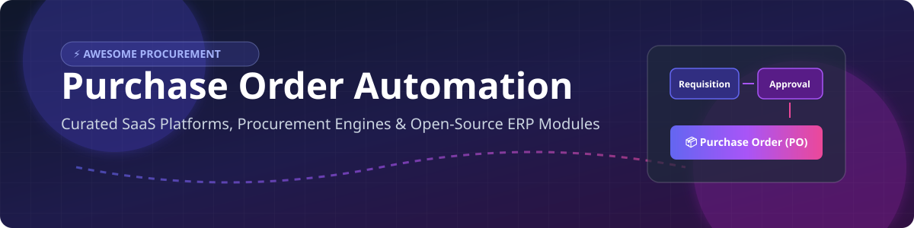

# 🛒 Awesome Purchase Order Automation

  
  
  
  

## 📌 Top Purchase Order Automation Platforms & Procurement Ecosystem

**Curated List of SaaS Platforms & Open-Source GitHub Projects**  
*Focused on Purchase Requisitions, Approvals, Purchase Orders, Procure-to-Pay (P2P), Spend Control & Invoice Matching*  
**Last updated: September 2026**

This repository tracks notable **SaaS platforms** and **open-source projects** for **Purchase Order Automation**. These enterprise procurement systems streamline the creation, approval routing, and tracking of purchase requisitions, PO generation, three-way invoice matching, and automated spend management workflows.

---

## 💡 Procurement Software Market Overview

> 📊 **Estimated Market Size:** The global procurement software market is estimated at **\$10 Billion – \$11.5 Billion (2026)** and is projected to reach **\$21 Billion – \$28 Billion by 2035** (growing at a CAGR of ~10–12%).
> 
> 🧩 **Market Structure:** The sector is **moderately fragmented**. It is **NOT a winner-take-all market**. While enterprise suite giants (SAP Ariba, Coupa) command large shares, modern mid-market teams and SMBs increasingly adopt best-of-breed intake-to-procure solutions (Zip, Ramp, Airbase, Precoro) and open-source ERP modules (Odoo, ERPNext) connected via APIs.

---

## 📑 Table of Contents
- [🏢 SaaS/Hosted Platforms](#-saashosted-platforms)
- [🔓 Open-Source GitHub Projects](#-open-source-github-projects)
- [🤝 How to Contribute](#-how-to-contribute)
- [💖 Support & Sponsorship](#-support--sponsorship)
- [⚖️ Disclaimer](#%EF%B8%8F-disclaimer)
- [📈 Star History](#-star-history)

---

## 🏢 SaaS/Hosted Platforms

The following commercial SaaS platforms provide enterprise purchase order automation, spend visibility, and intake-to-procure workflows. Listed in **descending order by estimated company valuation / size**:

| Product | Company Size / Valuation | Description | Starting Pricing | Free Tier / Trial Limits |
| :--- | :--- | :--- | :--- | :--- |
| **[Ramp Procurement](https://ramp.com/)** | **~\$44 Billion Valuation** (~\$1.5B ARR) | Procurement and purchasing capabilities within the Ramp finance platform, focused on spend control and visibility. | \$0/user/month (Core) / \$15/user/month (Ramp Plus platform) | **60-day free trial** for Procurement module; Free core plan with unlimited cards & basic expense management |
| **[SAP Ariba Buying](https://www.sap.com/products/spend-management/ariba.html)** | **Parent SAP SE \$250B+ Market Cap** (Ariba unit ~\$3B+ rev) | Enterprise procurement solution for guided buying, purchase orders, and supplier collaboration within the SAP ecosystem. | Custom quote-based (Annual subscription & transaction volume) | Guided buying interactive tour only (No free software trial); Free standard account for suppliers |
| **[Tipalti Procurement](https://tipalti.com/)** | **\$8.3 Billion Valuation** (>\$200M ARR) | Procurement capabilities within the Tipalti finance automation suite, supporting purchase processes and supplier payments. | \$99/month (Base platform fee + transaction volume) | No free trial available |
| **[Coupa Procurement](https://www.coupa.com/)** | **Acquired for \$8 Billion** (Thoma Bravo; ~\$800M+ ARR) | Enterprise procure-to-pay and spend management suite with robust purchase order and buying functionality. | Custom quote-based (Est. ~\$15,000–\$60,000+/year) | No free trial for buyer suite; Free tier available for Supplier Portal |
| **[Zip](https://ziphq.com/)** | **\$2.2 Billion Valuation** (~\$193M ARR) | Intake-to-procure platform that modernizes purchasing requests, approvals, and orchestration across tools. | Custom quote-based (Est. ~\$72,000/year average contract) | No free trial or free version |
| **[Airbase](https://www.airbase.com/)** | **Acquired by Paylocity (2024)** (~\$96M ARR) | Spend management platform that includes procurement and purchase order automation features. | Custom quote-based (Paid tiers) | **Free forever tier available** (Airbase Essentials for cards, bill pay, & expense management) |
| **[Procurify](https://www.procurify.com/)** | **Mid-Market Leader** (Est. ~\$55M ARR / Series C) | Mid-market procurement platform with strong intake-to-order workflows, budget visibility, and approval automation. | Custom quote-based (Est. ~\$1,000–\$2,000/month) | No free trial or free version |
| **[Order.co](https://www.order.co/)** | **Growing Mid-Market** (Est. ~\$29M ARR / Series B) | Procurement and purchase order platform focused on streamlining ordering, approvals, and vendor management for growing companies. | Custom quote-based (Est. ~\$12,000/year base contract) | No free trial or free version |
| **[Precoro](https://precoro.com/)** | **SMB / Mid-Market** (Est. ~\$3.5M ARR) | Purchase order and procurement software popular with SMBs and mid-market teams for requests, POs, and invoice matching. | \$499/month (Core Plan, billed annually) | **14-day free trial** (no credit card required) |
| **[Tradogram](https://www.tradogram.com/)** | **Bootstrapped SMB** (Est. ~\$1M ARR) | Cloud procurement and purchase order management software for organizations seeking streamlined purchasing processes. | \$99/month (Essentials Plan) | **Free forever plan** for 1 user & up to 10 purchase orders/month |

---

## 🔓 Open-Source GitHub Projects

Dedicated purchase-order automation platforms are largely commercial, but strong open-source options exist inside full ERP systems, business frameworks, and custom workflow engines.

Listed in **descending order by GitHub star count**:

- **[Odoo Purchase](https://github.com/odoo/odoo)**   
  Open-source purchase management module within Odoo ERP covering purchase requisitions, RFQs, purchase orders, goods receipts, and vendor management (Community edition available).

- **[ERPNext Buying / Purchase](https://github.com/frappe/erpnext)**   
  Fully open-source procurement module in ERPNext supporting material requests, RFQs, supplier quotations, purchase orders, and 3-way invoice matching.

- **[Apache OFBiz Purchasing](https://github.com/apache/ofbiz)**   
  Enterprise automation software suite with comprehensive procurement, order fulfillment, purchase order management, and inventory management capabilities.

- **[iDempiere ERP / Procurement](https://github.com/idempiere/idempiere)**   
  Community-driven open-source ERP system featuring end-to-end purchasing, requisition approvals, and purchase order tracking.

- **[Tryton Purchase Module](https://github.com/tryton/tryton)**   
  Modular open-source business application framework providing dedicated purchase request processing and PO handling.

- **[metasfresh ERP Procurement](https://github.com/metasfresh/metasfresh)**   
  Open-source enterprise ERP designed for high-volume order processing, automated procurement, and supply chain control.

- **[lsFusion ERP Purchasing](https://github.com/lsfusion/lsfusion)**   
  Declarative open-source platform and framework for building custom enterprise ERP purchasing modules.

### 🛠️ Open-Source Components & Workflow Building Blocks
- **Approval Workflow Engines:** General-purpose open engines (e.g., Camunda, Temporal) configurable for purchase requisition and PO approval chains.
- **Document & Form Builders:** Tools for creating digital purchase request forms with automated routing and notifications.
- **Vendor & Catalog Managers:** Lightweight open systems for maintaining supplier catalogs feeding into procurement systems.
- **3-Way Matching Experiments:** Scripts and tools comparing POs, receipts, and invoices for automated 3-way matching.

---

## 🤝 How to Contribute

1. Fork the repo.
2. Add/edit entries in `README.md` (following existing table and list formats).
3. Include: name, link, 1–2 sentence description, pricing/stars, and category.
4. Submit a Pull Request (PR) with a brief explanation.

---

## 💖 Support & Sponsorship

If you find this curated procurement resource useful, please consider supporting the project:

- ⭐ **Star** this repository to increase visibility.
- 🔀 **Fork** it to contribute additions or maintain your own version.
- 📢 **Share** it with procurement, finance, and DevOps teams.
- ☕ **Buy me a coffee / Sponsor:** Support ongoing maintenance via the [GitHub Sponsor Dashboard](https://github.com/sponsors/ishandutta2007).

Thank you for supporting open procurement automation tools! 🙌

---

## ⚖️ Disclaimer

- This is a **community-curated** list — not exhaustive and not an endorsement.
- Purchase order and procurement systems handle financial commitments and supplier data. Ensure proper access controls, audit trails, and compliance with internal policies and applicable regulations. Self-hosted open-source solutions require ongoing security and operational maintenance. This list is not financial or compliance advice.

---

## 📈 Star History

---

**Made for procurement, finance, and operations teams who want controlled, transparent, and automated purchasing.**
