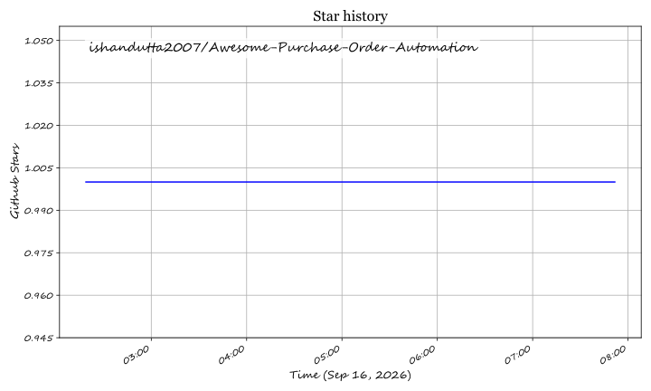

# Awesome-Purchase-Order-Automation

## Top Purchase Order Automation Platforms Ecosystem

**Curated List of SaaS Products & Open-Source GitHub Projects**
*Focused on Purchase Requisitions, Approvals, Purchase Orders, Procure-to-Pay & Spend Control*
**Last updated: September 2026**

This repository tracks notable **SaaS platforms** and **open-source projects** for **Purchase Order Automation**. These systems streamline the creation, approval, and management of purchase orders and related procurement workflows, often as part of broader procure-to-pay or spend management suites.

**Examples** include Order.co, Procurify, Precoro, Tipalti Procurement, Zip, Airbase, Ramp Procurement, Coupa Procurement, SAP Ariba Buying, and Tradogram (the category leaders).

**Open-source emphasis**: Dedicated purchase-order automation platforms are largely commercial. Strong open options exist inside full open-source ERPs — especially **Odoo Purchase** and **ERPNext Buying**. This section highlights these practical open alternatives and related components.

Contributions welcome! Open a PR to add/update entries. Keep descriptions factual and link to official sites.

## Table of Contents
- [SaaS/Hosted Platforms](#saas-products)
- [Open-Source GitHub Projects](#open-source-github-projects)
- [How to Contribute](#how-to-contribute)
- [Disclaimer](#disclaimer)

## SaaS/Hosted Platforms
- **[Order.co](https://www.order.co/)**  
  Procurement and purchase order platform focused on streamlining ordering, approvals, and vendor management for growing companies.

- **[Procurify](https://www.procurify.com/)**  
  Mid-market procurement platform with strong intake-to-order workflows, budget visibility, and approval automation.

- **[Precoro](https://precoro.com/)**  
  Purchase order and procurement software popular with SMBs and mid-market teams for requests, POs, and invoice matching.

- **[Tipalti Procurement](https://tipalti.com/)**  
  Procurement capabilities within the Tipalti finance automation suite, supporting purchase processes and supplier payments.

- **[Zip](https://ziphq.com/)**  
  Intake-to-procure platform that modernizes purchasing requests, approvals, and orchestration across tools.

- **[Airbase](https://www.airbase.com/)**  
  Spend management platform that includes procurement and purchase order automation features.

- **[Ramp Procurement](https://ramp.com/)**  
  Procurement and purchasing capabilities within the Ramp finance platform, focused on control and visibility.

- **[Coupa Procurement](https://www.coupa.com/)**  
  Enterprise procure-to-pay and spend management suite with robust purchase order and buying functionality.

- **[SAP Ariba Buying](https://www.sap.com/products/spend-management/ariba.html)**  
  Enterprise procurement solution for guided buying, purchase orders, and supplier collaboration within the SAP ecosystem.

- **[Tradogram](https://www.tradogram.com/)**  
  Cloud procurement and purchase order management software for organizations seeking streamlined purchasing processes.

## Open-Source GitHub Projects
- **[Odoo Purchase](https://github.com/odoo/odoo)**  
  Open-source purchase management module within Odoo ERP covering purchase requests, RFQs, purchase orders, receipts, and vendor management (Community edition available).

- **[ERPNext Buying / Purchase](https://github.com/frappe/erpnext)**  
  Fully open-source procurement module in ERPNext supporting material requests, RFQs, supplier quotations, purchase orders, and related workflows.

- **[Other open ERP purchase modules](https://github.com/)**  
  Additional open-source ERP and business systems that include purchasing and PO functionality (e.g., components of lsFusion-based or similar ERPs).

- **[Approval workflow open engines](https://github.com/)**  
  General-purpose open workflow and approval engines that can be configured for purchase requisition and PO approval chains.

- **[Document and form open builders](https://github.com/)**  
  Tools for creating digital purchase request and PO forms with routing and notifications.

- **[Vendor and catalog open managers](https://github.com/)**  
  Lightweight open systems for maintaining supplier lists and simple catalogs that feed purchasing processes.

- **[Invoice matching and three-way match open experiments](https://github.com/)**  
  Prototypes that compare POs, receipts, and invoices for basic automated matching.

- **[Spend analytics open dashboards](https://github.com/)**  
  Open BI and dashboard projects that can visualize purchasing data exported from ERPs or PO systems.

- **[Integration and API open connectors](https://github.com/)**  
  Scripts and connectors for linking open ERPs with accounting, inventory, or e-commerce systems.

- **[Self-hosted procurement portal open templates](https://github.com/)**  
  Community templates for internal purchasing portals built on open frameworks.

### Additional Strong Open-Source Options
- Starting with **Odoo Purchase** or **ERPNext Buying** when an organization wants full open-source control of the procure-to-pay process.
- Extending open ERPs with custom approval workflows and catalogs for mid-sized needs.
- Using open workflow engines on top of existing finance systems for lighter automation.
- Accepting that advanced guided buying, extensive supplier networks, complex global compliance, and deep analytics still favor commercial platforms (Coupa, SAP Ariba, Procurify, Precoro, Zip, etc.).
- Combining open ERP purchasing modules with commercial spend or payment tools for hybrid stacks.

**Frameworks for building custom systems**: Deploy Odoo or ERPNext → configure purchase request and PO workflows → set up multi-level approvals → integrate with inventory and accounting → add simple catalogs and vendor portals. This provides a complete open-source purchase order automation foundation. Commercial platforms remain the practical choice for enterprises and teams that need rapid deployment, advanced spend controls, and extensive integrations without managing an ERP.

## How to Contribute
1. Fork the repo.
2. Add/edit entries in `README.md` (follow existing format).
3. Include: name, link, 1–2 sentence description, and whether it's SaaS or open-source.
4. Submit PR with a short explanation.

Star the repo if you find it useful!

## Disclaimer
- This is a **community-curated** list — not exhaustive and not an endorsement.
- Purchase order and procurement systems handle financial commitments and supplier data. Ensure proper access controls, audit trails, and compliance with internal policies and applicable regulations. Self-hosted open-source solutions require ongoing security and operational maintenance. This list is not financial or compliance advice.

---
**Made for procurement, finance, and operations teams who want controlled and efficient purchasing.**
Let's keep purchase order processes transparent, automated, and as open as practical.

## ⭐ Star History

<a href="https://star-history.com/#ishandutta2007/Awesome-Purchase-Order-Automation&Timeline" align="center">
  <picture>
    <source media="(prefers-color-scheme: dark)" srcset="assets/ishandutta2007_Awesome-Purchase-Order-Automation_growth.svg">
    
  </picture>
</a>
